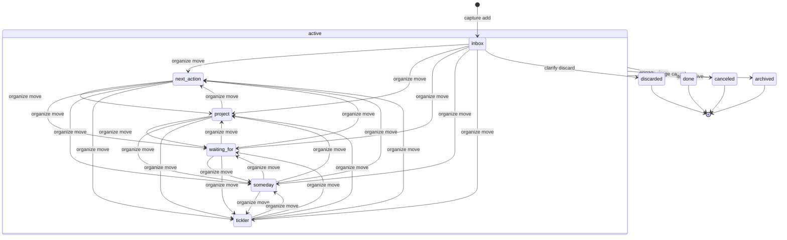

# htd Data Model Specification

## 1. Overview

All data is stored as Markdown files with YAML front matter on the local file system. There is no database. The file system directory structure encodes the item's category (kind) and active/archived state.

---

## 2. Item

An Item is the primary data type. It represents any actionable or incomplete piece of work.

### 2.1 Fields

| Field | Type | Required | Mutable | Description |
|-------|------|----------|---------|-------------|
| `id` | string | yes | **no** | Unique identifier (see §4) |
| `title` | string | yes | yes | Short description |
| `kind` | string | yes | yes | Category — one of the Kind enum (see §2.2) |
| `status` | string | yes | yes | Lifecycle state — one of the Status enum (see §2.3) |
| `project` | string | no | yes | ID of a project-kind item this belongs to |
| `created_at` | datetime | yes | **no** | Creation timestamp (RFC 3339) |
| `updated_at` | datetime | yes | yes | Last modification timestamp (RFC 3339) |
| `due_at` | date or datetime | no | yes | Due date |
| `defer_until` | date or datetime | no | yes | Item is hidden until this date |
| `review_at` | date | no | yes | Next review date |
| `source` | string | no | yes | Origin of the item (e.g., `manual`, `email`, `slack`) |
| `tags` | list of strings | no | yes | Arbitrary tags for filtering |

The Markdown body (content after the front matter `---` delimiter) stores the detailed description. This is referred to as `body` in CLI options but is not a front matter field.

### 2.2 Kind Enum

| Value | Directory | Description |
|-------|-----------|-------------|
| `inbox` | `items/inbox/` | Unclarified input |
| `next_action` | `items/next_action/` | Concrete, actionable task |
| `project` | `items/project/` | Multi-step outcome |
| `waiting_for` | `items/waiting_for/` | Delegated action |
| `someday` | `items/someday/` | Deferred for future |
| `tickler` | `items/tickler/` | Time-triggered reminder |

The `kind` field in front matter and the directory location must always be consistent. When `kind` changes, the file must be moved to the corresponding directory.

### 2.3 Status Enum

| Value | Terminal? | Archive? | Applicable kind | Set by |
|-------|-----------|----------|-----------------|--------|
| `active` | no | no | all | (initial state) |
| `done` | yes | yes | all | `engage done` |
| `canceled` | yes | yes | all | `engage cancel` |
| `discarded` | yes | yes | `inbox` only | `clarify discard` |
| `archived` | yes | yes | all | `item archive` |

Terminal statuses are effectively immutable — the item should not be modified further except for error correction.

When status changes to any terminal value, the file is moved from `items/<kind>/` to `archive/items/`.

### 2.4 Status Transition Diagram

The transitions differ depending on whether an item is still in the inbox or has been moved out.



- `organize move` changes an item's kind within the `active` state; it does not affect status.
- `discarded` is only reachable from `inbox` via `clarify discard`.
- All terminal transitions are one-way. Items cannot return to `active` (use `htd item update` for error correction only).

---

## 3. Reference

A Reference is non-actionable information stored for future retrieval. References are fully separate from Items — they cannot be promoted to Items or linked via the `project` field.

### 3.1 Fields

| Field | Type | Required | Mutable | Description |
|-------|------|----------|---------|-------------|
| `id` | string | yes | **no** | Unique identifier (same format as Item IDs) |
| `title` | string | yes | yes | Short description |
| `created_at` | datetime | yes | **no** | Creation timestamp (RFC 3339) |
| `updated_at` | datetime | yes | yes | Last modification timestamp (RFC 3339) |
| `tags` | list of strings | no | yes | Arbitrary tags for filtering |

The Markdown body stores the reference content.

### 3.2 Reference Archival

References can be archived by moving them from `reference/` to `archive/reference/`.

---

## 4. ID Specification

### 4.1 Format

```
YYYYMMDD-<slug>
```

- `YYYYMMDD` — The date the item was created (local time).
- `-` — A single hyphen separating the date from the slug.
- `<slug>` — A short, descriptive string in **snake_case** (lowercase letters, digits, underscores).

### 4.2 Rules

1. IDs must be unique across all items and references.
2. The slug is derived from the title at creation time (lowercase, spaces → underscores, non-alphanumeric characters removed).
3. If a generated ID collides with an existing one, append a numeric suffix: `20260417-write_docs_2`.
4. IDs are immutable — once assigned, they never change.

### 4.3 Examples

| Title | Generated ID |
|-------|-------------|
| Write the man page | `20260417-write_the_man_page` |
| Fix bug #42 | `20260417-fix_bug_42` |
| Q3 planning | `20260417-q3_planning` |

---

## 5. File Format

### 5.1 Item File

```markdown
---
id: 20260417-write_the_man_page
title: Write the man page
kind: next_action
status: active
project: launch_cli
created_at: 2026-04-17T09:00:00+09:00
updated_at: 2026-04-17T09:30:00+09:00
review_at: 2026-04-20
source: manual
tags: [cli, docs]
---

Detailed description of the task goes here.

Supports full Markdown:
- Lists
- Code blocks
- Links
```

### 5.2 Reference File

```markdown
---
id: headless_htd_design
title: CLI design notes
created_at: 2026-04-17T09:00:00+09:00
updated_at: 2026-04-17T09:00:00+09:00
tags: [design]
---

Reference content in Markdown.
```

### 5.3 Front Matter Rules

- YAML front matter is delimited by `---` on its own line.
- All datetime values use RFC 3339 format (e.g., `2026-04-17T09:00:00+09:00`).
- Date-only values use `YYYY-MM-DD` format (e.g., `2026-04-20`).
- Lists use YAML flow syntax: `[item1, item2]`.
- Optional fields with no value are omitted entirely (not set to `null` or empty string).

### 5.4 File Naming

The filename is the item's ID with a `.md` extension:

```
<id>.md
```

Examples:
- `20260417-write_the_man_page.md`
- `headless_htd_design.md`

---

## 6. Storage Layout

### 6.1 Directory Structure

```
<htd-root>/
├── items/
│   ├── inbox/
│   ├── next_action/
│   ├── waiting_for/
│   ├── someday/
│   ├── tickler/
│   └── project/
├── reference/
└── archive/
    ├── items/
    └── reference/
```

### 6.2 Directory Semantics

| Path | Contents |
|------|----------|
| `items/inbox/` | New, unclarified items |
| `items/next_action/` | Actionable tasks |
| `items/project/` | Multi-step outcomes |
| `items/waiting_for/` | Delegated actions |
| `items/someday/` | Deferred items |
| `items/tickler/` | Time-triggered reminders |
| `reference/` | Non-actionable reference materials |
| `archive/items/` | Items with terminal status (flat — no kind subdirectories) |
| `archive/reference/` | Archived reference materials |

### 6.3 Initialization

Running any `htd` command on an empty directory creates the full directory structure automatically. All directories are created, including empty ones, to ensure consistent layout. The `htd init` command makes this setup explicit and prints the resulting directory set, which is useful for scripting and for confirming the layout before capturing items.

### 6.4 File Location Rules

1. An **active item** is stored at: `items/<kind>/<id>.md`
2. A **terminal item** (done/canceled/discarded/archived) is stored at: `archive/items/<id>.md`
3. An **active reference** is stored at: `reference/<id>.md`
4. An **archived reference** is stored at: `archive/reference/<id>.md`

When an item's kind or status changes, the file is physically moved to the correct location. The front matter and directory location must always agree.

---

## 7. Relationships

### 7.1 Item → Project Link

An item can be linked to a project via the `project` field. This field contains the ID of a project-kind item.

**Constraints:**

- The referenced project must exist and have `kind: project`.
- A project item itself must not have a `project` field (no nesting).
- Deleting or archiving a project does not cascade to linked items.

### 7.2 Querying Linked Items

To find all items linked to a project, filter all active items where `project == <project-id>`. There is no reverse-link stored on the project item itself.

---

## 8. Timestamps

| Field | Set On | Updated On |
|-------|--------|------------|
| `created_at` | Item creation | Never |
| `updated_at` | Item creation | Every modification |

Timestamps use the system's local timezone in RFC 3339 format. The timezone offset is always included (e.g., `+09:00`, not `Z` unless UTC).

---

## 9. Git Integration

The data model is designed for Git version control:

- **No generated index files** — All state is derived from the file system.
- **Deterministic paths** — Given an ID and status, the file path is fully determined.
- **Clean diffs** — YAML front matter changes produce readable diffs.
- **No lock files** — Single-user assumption; no concurrent access control.

Recommended `.gitignore`: none — all files in the htd root should be tracked.
